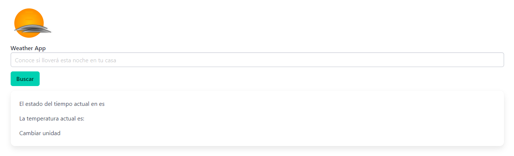
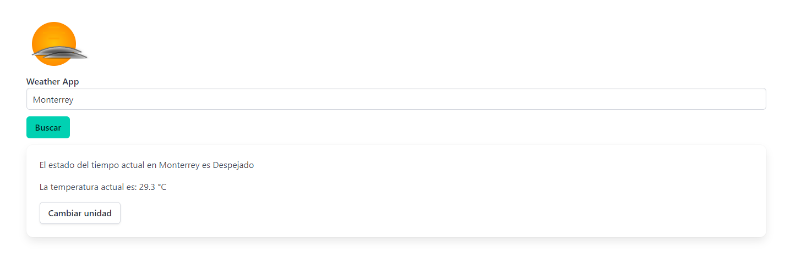

# Weather App
Esta es una aplicación desarrollada en Angular, te permitirá consultar el clima en la localidad que desees

Por ejemplo hoy quiero saber si habra un buen clima para la carnita asada en Monterrey:

Y si definitivamente es pisteable ;)

Esta App consume el API "weatherapi":https://www.weatherapi.com/

El frontend fue realizado usando:https://bulma.io/

Enjoy!